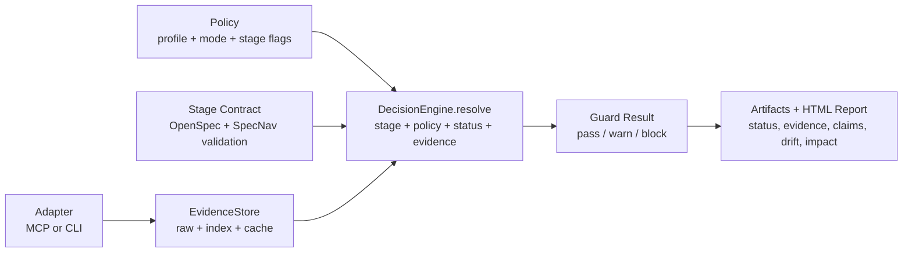

# SpecNav CodeGraph Evidence Layer Design

Status: design draft

Applies to:

- `specnav-claude-plugin`
- `specnav-codex-plugin`

Core statement:

```text
SpecNav owns the lifecycle. CodeGraph supplies code evidence.
```

Chinese README statement:

```text
SpecNav 负责流程闭环，CodeGraph 提供代码证据。
```

## 1. Purpose

`specnav-codegraph` adds a code-evidence layer to SpecNav. It does not replace
OpenSpec, SpecNav stage contracts, or normal verification commands. It gives
SpecNav a structured way to ask the current codebase questions about symbols,
call paths, routes, dependencies, reusable components, and blast radius.

The target is to prevent two common AI coding failures:

- specs or task reports claim APIs, components, routes, services, or data flows
  that do not exist in the actual project;
- implementation and verification rely on broad grep/read exploration instead
  of durable code evidence that can be replayed, audited, and shown in reports.

## 2. What CodeGraph Provides

CodeGraph is an external local code-intelligence tool. After a project runs
`codegraph init`, it creates a project-local `.codegraph/` index backed by a
SQLite database. Its MCP server normally exposes one primary tool:
`codegraph_explore`.

`codegraph_explore` returns:

- relevant source grouped by file;
- line-numbered code snippets;
- call paths and structural relationships;
- blast-radius / impact context;
- guidance when the queried project is not indexed.

SpecNav treats this as code evidence, not as lifecycle state.

## 3. Non-Goals

`specnav-codegraph` must not:

- silently run `codegraph install`;
- silently run `codegraph init`;
- silently edit `~/.claude.json`, `~/.claude/settings.json`, or
  `~/.codex/config.toml` from a hook;
- replace OpenSpec artifacts;
- replace `rg`, `Read`, or file parsers for docs/configs/prototypes that
  CodeGraph does not index;
- replace tests, type checks, lint, database migrations, or runtime validation;
- claim code evidence without writing a durable evidence artifact.

## 4. Preinstall Model

"Preinstalled" means SpecNav ships the integration plugin, not the external
CodeGraph CLI and not a project index.

There are three layers:

| Layer | Owner | How it appears | May be automatic |
| --- | --- | --- | --- |
| SpecNav integration | SpecNav marketplace | `specnav-codegraph` plugin | yes, installed with the suite |
| Agent MCP wiring | user action through setup skill | CodeGraph MCP server in Claude/Codex config | no hook writes |
| Project index | user action per repository | `.codegraph/codegraph.db` | no silent init |

The suite may include `specnav-codegraph` by default. The plugin is allowed to
check status at session start, but any global config mutation or index creation
must be done only when the user invokes an explicit setup/init skill.

### 4.1 CodeGraph Policy and Runtime Modes

SpecNav must distinguish three different concepts:

- whether the `specnav-codegraph` integration plugin is installed;
- whether the external CodeGraph CLI/MCP/index is available;
- whether the current project policy requires CodeGraph evidence for a stage.

There is no silent fallback. If CodeGraph is unavailable, SpecNav either blocks
the stage that requires it or records an explicit project policy that says this
project is running without CodeGraph evidence.

Project policy shape:

```json
{
  "codegraph_policy": {
    "enabled": true,
    "mode": "observe|advisory|required|disabled",
    "requirements_required": false,
    "prototype_required": false,
    "development_required": true,
    "verification_required": true,
    "operations_required": true,
    "disabled_reason": null
  }
}
```

Mode semantics:

| Mode | Meaning | Stage behavior |
| --- | --- | --- |
| `disabled` | The project explicitly opts out of CodeGraph. | SpecNav may proceed, but cannot claim CodeGraph verification. The disable reason must be written to artifacts/reports. |
| `observe` | SpecNav probes CodeGraph if available. | Missing evidence is recorded but does not block. |
| `advisory` | SpecNav should collect CodeGraph evidence for code-backed claims. | Gaps become warnings unless the stage has `*_required: true`. |
| `required` | CodeGraph evidence is part of the stage contract. | Missing, stale, wrong-root, or unverifiable evidence blocks completion. |

The escape hatch is explicit, auditable, and project-scoped:

```json
{
  "codegraph_policy": {
    "enabled": false,
    "mode": "disabled",
    "disabled_reason": "Project does not allow local code indexing."
  }
}
```

`codegraph:disabled-for-project` is not a fallback path. It is an explicit
policy state that must appear in status, claims maps, verification reports, and
HTML reports whenever a code-backed stage proceeds without CodeGraph evidence.

### 4.2 Enforcement Profiles

Profiles are presets that expand into an effective `codegraph_policy`. They are
not a separate decision system.

```json
{
  "codegraph_enforcement_profile": "bootstrap|active_dev|production|custom"
}
```

Profile defaults:

| Profile | Default mode | Required stages | Purpose |
| --- | --- | --- | --- |
| `bootstrap` | `observe` | none | New repository onboarding without immediate blocking. |
| `active_dev` | `advisory` | none by default | Normal feature work where evidence gaps should be visible before becoming hard gates. |
| `production` | `required` | development, verification, operations | Release-bound work where code claims must be verified. |
| `custom` | explicit policy only | explicit policy only | Project-specific governance. |

Profile expansion order:

```text
profile preset
  -> project codegraph_policy override
  -> stage required flag
  -> DecisionEngine result
```

This creates a gradual enforcement curve without hiding problems:

```text
bootstrap -> observe
active_dev -> advisory
production -> required
```

### 4.3 Runtime Model

SpecNav CodeGraph runtime must be implemented as one governed pipeline, not as
independent checks scattered across hooks, skills, and scripts.



Runtime ownership:

- `Policy` defines intent.
- `Stage Contract` defines what the current lifecycle stage must prove.
- `Adapter` obtains facts through MCP or CLI.
- `EvidenceStore` persists facts in raw/index/cache layers.
- `DecisionEngine` produces the single authoritative pass/warn/block result.
- `Guard` enforces the decision.
- `Artifact` makes the decision auditable.

## 5. Plugin Boundary

New plugin:

```text
plugins/specnav-codegraph/
  .claude-plugin/plugin.json       # Claude edition
  .codex-plugin/plugin.json        # Codex edition
  skills/
    specnav-codegraph-setup/
    specnav-codegraph-init/
    specnav-codegraph-status/
    specnav-codegraph-context/
    specnav-codegraph-claims/
    specnav-codegraph-impact/
  core/
    codegraph-status-manager.js
    codegraph-context-builder.js
    codegraph-evidence-writer.js
    codegraph-guard.js
    codegraph-drift-detector.js
    codegraph-decision-engine.js
    codegraph-evidence-store.js
  adapters/
    mcp-client.ts
    cli-client.ts
  schemas/
    status.schema.json
    evidence.schema.json
    evidence-index.schema.json
    claims.schema.json
    drift.schema.json
    decision.schema.json
  runtime/
    artifact-writer.ts
    stage-integration.ts
    decision-engine.ts
    evidence-store.ts
  scripts/
    codegraph-doctor.js
    codegraph-contract.js
    codegraph-setup.js
    codegraph-init.js
    codegraph-context.js
    codegraph-claims.js
    codegraph-impact.js
  assets/
    evidence-query-plan.json
    claims-map.json
    drift-report.json
  specnav-stage.json
```

`specnav-core` continues to own hooks, workflow state, plugin-suite resolution,
and router affordances. `specnav-codegraph` owns only CodeGraph dependency
checks, artifact generation, and evidence contracts.

## 6. Public Skills

| Skill | Purpose |
| --- | --- |
| `specnav-codegraph-setup` | Explicitly install or repair CodeGraph CLI/MCP wiring for the current host agent. |
| `specnav-codegraph-init` | Explicitly initialize the current project with `codegraph init`. |
| `specnav-codegraph-status` | Report CLI, MCP, config, project index, staleness, and worktree status. |
| `specnav-codegraph-context` | Build durable code context for an active change or task. |
| `specnav-codegraph-claims` | Map OpenSpec/SpecNav claims to concrete code evidence. |
| `specnav-codegraph-impact` | Produce blast-radius and affected-surface evidence before verification/release. |

Skills must state that CodeGraph setup and indexing are explicit actions.
They must not tell the model to invent evidence when CodeGraph is absent.

### 6.1 Agent Edition Responsibilities

Both agent editions share the same evidence contract, artifact paths, status
schema, blockers, and reports. They differ only in how they acquire evidence.

`specnav-claude-plugin` responsibilities:

- interpret CodeGraph output into stage context;
- build claim maps for requirements, prototype, development, verification, and
  operations;
- generate stakeholder reports that explain evidence quality;
- prefer MCP when visible in Claude Code.

`specnav-codex-plugin` responsibilities:

- provide a CLI-first adapter for non-interactive execution;
- call `codegraph status --json` and `codegraph explore "<query>"` through the
  same artifact writer;
- mutate Codex MCP config only inside `specnav-codegraph-setup`;
- use MCP when exposed, but treat CLI as a first-class execution surface.

## 7. External Dependency Contract

Minimum external dependency:

```text
codegraph >= 1.1.6
```

Status checks:

```bash
codegraph version
codegraph status --json
```

The setup script may use CodeGraph's official non-interactive installer entry
points when explicitly invoked:

```bash
codegraph install --target=claude --yes
codegraph install --target=codex --yes
```

Or it may write the equivalent config directly after explicit user command.
The direct config shape must match CodeGraph's own installer:

Claude global MCP:

```json
{
  "mcpServers": {
    "codegraph": {
      "type": "stdio",
      "command": "codegraph",
      "args": ["serve", "--mcp"]
    }
  }
}
```

Claude auto-allow:

```json
{
  "permissions": {
    "allow": ["mcp__codegraph__*"]
  }
}
```

Codex global MCP:

```toml
[mcp_servers.codegraph]
command = "codegraph"
args = ["serve", "--mcp"]
```

When setup changes agent config, the result must report
`codegraph:restart-required`. The current session should not pretend the MCP
tool is already available.

## 8. Runtime Artifacts

For each active change:

```text
openspec/changes/<change>/codegraph/
  status.json
  evidence-query-plan.json
  evidence.jsonl
  evidence-index.json
  claims-map.json
  drift-report.json
  impact-report.json
```

For each development task:

```text
openspec/changes/<change>/development/tasks/<task-id>/codegraph-context.md
openspec/changes/<change>/development/tasks/<task-id>/codegraph-impact.json
```

For verification:

```text
openspec/changes/<change>/verify/codegraph-facticity.json
openspec/changes/<change>/verify/codegraph-impact.json
```

For operations:

```text
openspec/changes/<change>/operations/codegraph-release-risk.json
```

Artifacts are append-only where possible. A new run appends evidence with
timestamps and source stage instead of overwriting prior claims.

`EvidenceStore` separates evidence into three layers:

| Layer | File | Purpose | Durability |
| --- | --- | --- | --- |
| Raw | `evidence.jsonl` | Append-only query records and source mappings. | durable |
| Index | `evidence-index.json` | Current summary by stage, claim, symbol, file, blocker, and confidence. | durable |
| Cache | `.specnav/cache/codegraph/<change>/query-cache.json` | Rebuildable query response cache for repeated exploration. | disposable |

Reports, guards, and drift checks should read `evidence-index.json` first. When
the index is missing or stale, they must replay raw `evidence.jsonl` and
regenerate the index before making a gate decision. A cache entry must never be
the only proof for a claim.

## 9. Status Artifact

`status.json` schema:

```json
{
  "schema": "specnav.codegraph.status.v1",
  "generated_at": "ISO-8601",
  "project_root": "/absolute/project",
  "active_change": "change-id",
  "policy": {
    "enabled": true,
    "profile": "production",
    "mode": "required",
    "required_for_stage": true,
    "disabled_reason": null
  },
  "execution_surface": "mcp|cli|none",
  "decision": {
    "stage": "development",
    "result": "pass|warn|block",
    "reason": "CodeGraph evidence satisfied for required stage."
  },
  "cli": {
    "available": true,
    "version": "1.1.6",
    "path": "/usr/local/bin/codegraph"
  },
  "mcp": {
    "configured": true,
    "visible_in_current_session": false,
    "restart_required": true
  },
  "index": {
    "initialized": true,
    "projectPath": "/absolute/project",
    "indexPath": "/absolute/project/.codegraph",
    "lastIndexed": "ISO-8601",
    "fileCount": 123,
    "nodeCount": 456,
    "edgeCount": 789,
    "pendingChanges": {
      "added": 0,
      "modified": 0,
      "removed": 0
    },
    "reindexRecommended": false,
    "worktreeMismatch": null
  },
  "blockers": []
}
```

The contract must compare `project_root`, `active_change`, and
`codegraph status --json.projectPath`. If CodeGraph resolves a different
worktree or project root, the evidence is invalid for the active change.

## 9.1 Decision Engine

All stage gating must call one resolver:

```text
DecisionEngine.resolve(stage, profile, policy, status, evidenceIndex)
```

The resolver returns:

```json
{
  "schema": "specnav.codegraph.decision.v1",
  "stage": "development",
  "profile": "production",
  "effective_mode": "required",
  "required_for_stage": true,
  "execution_surface": "cli",
  "result": "pass|warn|block",
  "blockers": [],
  "warnings": [],
  "explanation": "CodeGraph evidence satisfied for development."
}
```

Decision precedence:

1. Expand `codegraph_enforcement_profile` into default policy.
2. Apply explicit project `codegraph_policy` overrides.
3. Apply stage required flags as the final intent for the active stage.
4. Evaluate runtime status and evidence into blockers or warnings.
5. Return one authoritative decision.

Conflict resolution:

| Condition | Result |
| --- | --- |
| `mode: disabled` with non-empty `disabled_reason` | `warn`, plus `codegraph:disabled-for-project`; no CodeGraph verification claims allowed. |
| `mode: observe` and evidence missing | `warn`, not block. |
| `mode: advisory` and stage flag is false | `warn`, not block. |
| `mode: advisory` and stage flag is true | `block` on missing required evidence. |
| `mode: required` | `block` on missing, stale, wrong-root, or unverifiable evidence. |
| unsupported CLI/MCP/index state in a required stage | `block` with exact blocker codes. |

No hook, skill, adapter, or report generator may implement its own separate
policy/stage/blocker decision tree.

## 10. Evidence Artifact

`evidence.jsonl` entry schema:

```json
{
  "schema": "specnav.codegraph.evidence.v1",
  "generated_at": "ISO-8601",
  "stage": "requirements|prototype|development|verification|operations",
  "task_id": "001-slice",
  "claim_id": "REQ-001",
  "query": "How does payroll payslip generation flow from UI to service?",
  "tool": "mcp:codegraph_explore|cli:codegraph explore",
  "project_path": "/absolute/project",
  "result_summary": "Found PayslipService and PayrollRunController flow.",
  "files": [
    {
      "path": "src/payroll/PayslipService.ts",
      "symbols": ["PayslipService.generate"],
      "lines": "12-94"
    }
  ],
  "relationships": ["PayrollRunController.create -> PayslipService.generate"],
  "confidence": "matched|partial|missing|not-indexed|stale",
  "blockers": []
}
```

An evidence record with `confidence: missing`, `not-indexed`, or `stale` cannot
satisfy a required claim.

`evidence-index.json` summary schema:

```json
{
  "schema": "specnav.codegraph.evidence_index.v1",
  "generated_at": "ISO-8601",
  "active_change": "change-id",
  "source_raw": "openspec/changes/<change>/codegraph/evidence.jsonl",
  "by_claim": {
    "CLAIM-001": {
      "status": "verified|partial|missing|stale|disabled",
      "evidence_ids": ["ev-001"],
      "files": ["src/payroll/PayslipService.ts"],
      "symbols": ["PayslipService.generate"],
      "blockers": []
    }
  },
  "by_stage": {
    "development": {
      "verified": 3,
      "partial": 1,
      "missing": 0,
      "stale": 0
    }
  },
  "blockers": []
}
```

The index is a summary, not a source of truth. It is valid only when its
`source_raw` file is present and newer than the last evidence append.

## 11. Claims Map

`claims-map.json` connects SpecNav claims to code evidence:

```json
{
  "schema": "specnav.codegraph.claims.v1",
  "active_change": "change-id",
  "claims": [
    {
      "id": "CLAIM-001",
      "source": "openspec/changes/<change>/requirements.md",
      "text": "HR can generate payslips.",
      "expected_code_evidence": [
        "route or controller",
        "service function",
        "UI entry point"
      ],
      "evidence_ids": ["ev-001", "ev-002"],
      "status": "verified"
    }
  ]
}
```

Every change-level artifact that names a component, route, API, service,
database effect, or cross-layer flow must either:

- reference CodeGraph evidence; or
- explicitly mark why CodeGraph is not the correct evidence source, for example
  documentation-only, configuration-only, prototype-only, or non-code artifact.

## 12. Drift Report

`drift-report.json` identifies mismatches between SpecNav artifacts and current
code:

```json
{
  "schema": "specnav.codegraph.drift.v1",
  "active_change": "change-id",
  "drift": [
    {
      "claim_id": "CLAIM-001",
      "type": "missing-symbol|missing-route|wrong-flow|stale-index|wrong-root",
      "severity": "blocking|warning",
      "message": "requirements.md names PayslipService, but CodeGraph found no matching symbol."
    }
  ],
  "blockers": []
}
```

Blocking drift prevents the owning stage from completing.

## 13. Blocker Semantics

Required blockers:

| Blocker | Meaning |
| --- | --- |
| `codegraph:plugin-missing` | `specnav-codegraph` is required but not installed. |
| `codegraph:cli-missing` | `codegraph` command is not on PATH. |
| `codegraph:unsupported-version` | CodeGraph version is below the supported floor. |
| `codegraph:mcp-not-configured` | Agent config lacks CodeGraph MCP server. |
| `codegraph:restart-required` | Config changed but current session cannot see MCP yet. |
| `codegraph:not-indexed` | No project `.codegraph/` index exists. |
| `codegraph:index-stale` | Pending changes or reindex recommendation makes evidence stale. |
| `codegraph:wrong-project-root` | CodeGraph resolved a different project/worktree. |
| `codegraph:claim-unverified` | A required code claim has no matching evidence. |
| `codegraph:coverage-gap` | Artifact contains code claims without evidence mapping. |
| `codegraph:evidence-stale` | Production edits happened after evidence generation. |
| `codegraph:disabled-for-project` | The project explicitly disabled CodeGraph evidence. This must be reported and cannot satisfy CodeGraph-required claims. |

There is no fallback for a stage that declares CodeGraph evidence as required.
For artifacts outside CodeGraph's scope, SpecNav must use the correct primary
evidence source and record that decision.

If `mode: disabled`, the stage gate must not pretend evidence exists. It may
allow progress only because the project policy says CodeGraph is disabled. Every
code-backed claim remains `not-codegraph-verified` unless another primary
evidence source is explicitly valid for that artifact type.

## 14. Evidence Source Policy

CodeGraph is primary evidence for:

- code symbols;
- functions and classes;
- route handlers;
- services and repositories;
- component/hook/service relationships;
- call paths and dependency edges;
- blast radius and impact surfaces.

SpecNav artifact parsers are primary evidence for:

- OpenSpec markdown;
- foundation specs;
- `scope.json`;
- requirements maps;
- prototype manifests;
- generated HTML prototypes;
- verification receipts;
- operations readiness files.

Direct file reads are primary evidence for:

- configs CodeGraph does not index;
- docs;
- screenshots and image metadata;
- generated reports;
- lockfiles or project manifests when CodeGraph cannot answer the question.

Using a non-CodeGraph evidence source for non-code artifacts is not fallback.
It is the correct evidence boundary.

## 15. Stage Integration

### 15.1 Core

`specnav-core` should include CodeGraph status in workflow state when the plugin
is installed:

- `codegraph.available`
- `codegraph.enabled`
- `codegraph.mode`
- `codegraph.indexed`
- `codegraph.stale`
- `codegraph.required_for_stage`
- `codegraph.execution_surface`
- `codegraph.blockers`

Session and prompt hooks may print status, but must not install, initialize, or
sync CodeGraph.

Stage gate rule:

```text
stage may complete only if:
  spec validation passes
  AND DecisionEngine.resolve(...).result is pass or accepted warning
```

When `codegraph.required_for_stage` is true, the guard must require a fresh
status artifact and stage-appropriate evidence artifact. When it is false, the
guard still writes the effective policy so reports can distinguish "not needed"
from "missing but ignored".

Accepted warnings are allowed only for `observe`, non-required `advisory`, or
explicit `disabled` policy with a non-empty reason. A required stage cannot
convert a blocker into an accepted warning.

### 15.2 Requirements

Repository discovery should ask CodeGraph for existing architecture evidence
when an index exists:

- current routes and handlers;
- component/hook/service surfaces;
- existing data-flow entry points;
- reusable component candidates;
- affected modules for the requested feature.

Output:

```text
openspec/changes/<change>/codegraph/evidence.jsonl
openspec/changes/<change>/codegraph/claims-map.json
```

Requirements must not invent code-backed claims when CodeGraph contradicts or
cannot verify them.

### 15.3 Prototype

Prototype planning uses CodeGraph to find existing UI primitives, components,
hooks, route conventions, and state patterns. The prototype still remains an
isolated artifact; CodeGraph evidence informs what should be reused or
reimplemented, not copied blindly.

Prototype handoff must record which CodeGraph evidence influenced:

- components to reuse;
- components to extract;
- API/data-flow expectations;
- theme/locale control availability when implemented in code.

### 15.4 Development

Each vertical slice must start with a CodeGraph context packet when CodeGraph is
required for the change:

```text
development/tasks/<task-id>/codegraph-context.md
development/tasks/<task-id>/codegraph-impact.json
```

The task brief must list:

- symbols/files CodeGraph identified;
- call paths relevant to the slice;
- impact surfaces;
- evidence gaps that require user/spec decisions.

After production edits, `specnav-post-tool` should mark CodeGraph evidence stale
for the active change. The next handoff must regenerate status/evidence or block
with `codegraph:evidence-stale`.

### 15.5 Verification

Six-domain verification uses CodeGraph mainly in:

- facticity/authenticity audit;
- static analysis triage;
- E2E flow mapping;
- impact analysis before aggregate verdict.

Verification report additions:

```text
verify/codegraph-facticity.json
verify/codegraph-impact.json
```

The aggregate report and HTML report must show CodeGraph evidence only when the
evidence contract is green.

### 15.6 Operations

Release and archive use CodeGraph for blast radius and affected surface review:

- changed symbols;
- callers/callees;
- affected routes/components/services;
- likely test surfaces.

Operations readiness must include:

```text
operations/codegraph-release-risk.json
```

If impact evidence is stale after final code edits, release and archive are
blocked.

## 16. MCP and CLI Usage Rules

Evidence acquisition is selected by host capability and policy:

1. Claude edition should use MCP `codegraph_explore` when the current host
   exposes it.
2. Codex edition should use the CLI adapter first unless MCP is explicitly
   exposed in the current session.
3. If the selected surface is unavailable but another configured surface exists,
   the adapter may use that surface only after recording
   `execution_surface: "mcp"` or `execution_surface: "cli"` in the artifact.
4. If no configured surface exists and the stage requires CodeGraph, report
   exact blockers.

CLI execution:

```bash
codegraph explore "<query>"
```

The CLI path is not fallback when MCP is invisible in subagents or Codex
sessions. It is an explicit supported execution surface and must write the same
evidence artifact.

Subagents must receive a short instruction block:

```text
If .codegraph/ exists, use codegraph explore "<question>" before grep/read for
code structure questions. If .codegraph/ does not exist, do not run init unless
the controller explicitly requests it.
```

## 17. Desynchronization Handling

SpecNav must handle these drift classes:

| Drift class | Detection | Resolution |
| --- | --- | --- |
| Time drift | `pendingChanges` or `reindexRecommended` in `codegraph status --json` | block with `codegraph:index-stale` |
| Worktree drift | `worktreeMismatch` or root mismatch | block with `codegraph:wrong-project-root` |
| Claim drift | spec claim cannot map to code evidence | block with `codegraph:claim-unverified` |
| Scope drift | changed files after evidence generation | block with `codegraph:evidence-stale` |
| Coverage drift | artifact contains unmapped code claims | block with `codegraph:coverage-gap` |

SpecNav must not say "CodeGraph verified this" unless the evidence file contains
the query and matching source paths/symbols.

## 18. Privacy and Telemetry

CodeGraph is local-first, but its installer includes an anonymous telemetry
choice. SpecNav must not silently decide telemetry for the user.

Rules:

- `specnav-codegraph-setup` must disclose when it is delegating to
  `codegraph install`.
- If direct config writing is used, SpecNav should not alter CodeGraph
  telemetry settings.
- SpecNav must not write secrets into CodeGraph config or evidence artifacts.
- Evidence artifacts should use repository-relative paths where possible.

## 19. README and Image Updates

After implementation, both English and Chinese READMEs must be updated. The
README story changes from a seven-stage lifecycle to a seven-stage lifecycle
with a cross-cutting CodeGraph evidence layer.

Required README changes:

- Add a CodeGraph evidence layer section.
- Add a runtime model diagram showing Policy -> Stage -> Adapter -> Evidence ->
  Guard -> Artifact.
- Add setup/init instructions:

  ```text
  $specnav-codegraph-setup
  $specnav-codegraph-init
  $specnav-codegraph-status
  ```

- Explain that CodeGraph setup and project indexing are explicit.
- Explain blocker semantics.
- Explain that CodeGraph does not replace OpenSpec contracts or tests.
- Add a report example showing Spec artifacts + CodeGraph evidence +
  verification verdict.

Required images, in both `en/` and `zh-CN/`:

| Image | Change |
| --- | --- |
| overview | Add a CodeGraph evidence rail across all stages. |
| stage 1 bootstrap | Add optional CodeGraph setup/init station. |
| stage 2 discovery | Show repository discovery using CodeGraph evidence. |
| stage 3 requirements | Show code-backed claim mapping. |
| stage 4 prototype | Show existing component discovery. |
| stage 5 development | Show vertical slice context + impact evidence. |
| stage 6 verification | Show facticity and impact audit from CodeGraph. |
| stage 7 operations | Show release blast radius and affected tests. |
| report | Add new stakeholder report image with evidence cards. |

The visual style remains the accepted SpecNav B+D style:

- isometric engineering workbench;
- route-map journey diagram;
- warm parchment/cream map;
- teal/navy infrastructure;
- muted green landscape;
- restrained coral/gold highlights;
- bilingual image sets generated as native images, not text overlays.

New prompt concept:

```text
Create a SpecNav B+D style workflow map where CodeGraph appears as a
cross-cutting evidence rail under the lifecycle road. Show code evidence cards
feeding requirements, prototype, development, verification, and operations.
Keep the same route geometry, station rhythm, palette, workbench islands, and
technical-map tone as the existing SpecNav README images.
```

## 20. HTML Report Updates

Stakeholder HTML reports must add a CodeGraph evidence section:

- CodeGraph status at report time;
- indexed project path and last indexed time;
- claims verified by code evidence;
- claims with gaps;
- impact summary;
- stale evidence warnings;
- links to local artifact paths.

The report must not embed long source dumps. It should summarize evidence and
link to the artifact files.

## 21. Implementation Sequence

Recommended build order:

1. Add `specnav-codegraph` plugin skeleton to both repositories.
2. Add enforcement profiles and effective policy expansion.
3. Add `DecisionEngine.resolve(...)` and make stage gates depend on it.
4. Add `EvidenceStore` raw/index/cache layers.
5. Add `codegraph-doctor.js` and status contract.
6. Add setup/init skills without hook-side mutation.
7. Add evidence artifact schema and context generator.
8. Wire requirements repository discovery to optional CodeGraph evidence.
9. Wire development vertical-slice entry to CodeGraph context.
10. Wire verification facticity and operations impact evidence.
11. Add hook state display and stale-evidence marker.
12. Add tests for CLI missing, MCP missing, disabled project, not indexed,
    stale index, wrong root, and claim-unverified states.
13. Update README, bilingual images, and HTML report template.

## 22. Test Plan

Required fixtures:

- no CodeGraph CLI;
- CLI present but MCP missing;
- MCP configured but restart required;
- project not indexed;
- indexed project with clean status;
- indexed project with pending changes;
- wrong worktree/index mismatch;
- claim maps to code;
- claim cannot map to code;
- post-edit evidence stale;
- subagent CLI mode writes the same evidence schema.
- project policy disabled with required stages not claiming CodeGraph evidence;
- observe/advisory/required mode stage-gate differences.
- bootstrap/active_dev/production profile expansion;
- evidence-index regeneration from raw `evidence.jsonl`;
- stale or missing `evidence-index.json` forcing raw replay or regeneration;
- every stage gate using `DecisionEngine.resolve(...)` instead of local policy
  logic.

Required commands:

```bash
node plugins/specnav-codegraph/scripts/codegraph-doctor.js --json
node plugins/specnav-codegraph/scripts/codegraph-contract.js --json
node plugins/specnav-codegraph/scripts/codegraph-context.js --json
node plugins/specnav-codegraph/scripts/codegraph-impact.js --json
```

Claude and Codex smoke tests must both include `specnav-codegraph` suite
resolution checks.

## 23. Open Decisions

These decisions should be confirmed before implementation:

1. Should `specnav-codegraph` be required for all code projects, or required
   only once a project explicitly enables CodeGraph evidence?
2. Should `specnav-codegraph-setup` call `codegraph install`, or should SpecNav
   write the minimal config itself?
3. Should project indexing be one-time manual only, or may a user-approved
   setup run both MCP setup and `codegraph init` in one command?
4. Should stale CodeGraph evidence block requirements, or only development and
   later stages?
5. Should HTML reports include only summaries, or also short source excerpts
   from CodeGraph evidence?
6. Should project-level `mode: disabled` be allowed globally, or only in
   repositories that set an explicit disabled reason?
7. Should `active_dev` default to advisory-only, or should some teams enable
   development-required as soon as an index exists?
8. Should `evidence-index.json` be regenerated on every evidence append, or
   lazily during guard/report generation?

Recommended defaults:

- `specnav-codegraph` ships with the suite.
- Setup and init remain explicit user actions.
- Project-level disablement is allowed only through explicit policy with a
  non-empty `disabled_reason`.
- Default profile is `bootstrap` before project indexing, `active_dev` after
  indexing, and `production` only when the user or repo policy opts in.
- All policy/stage/blocker decisions go through `DecisionEngine.resolve(...)`.
- `evidence.jsonl` remains raw source of truth; `evidence-index.json` is the
  report and guard summary layer.
- `production` profile requires CodeGraph evidence for development,
  verification, and operations.
- `active_dev` profile records development, verification, and operations gaps as
  warnings unless the project policy explicitly makes a stage required.
- Requirements may proceed without CodeGraph only when the project has no
  CodeGraph policy enabled; if enabled, missing evidence blocks code-backed
  claims.
- HTML reports include summaries and artifact links, not source dumps.
